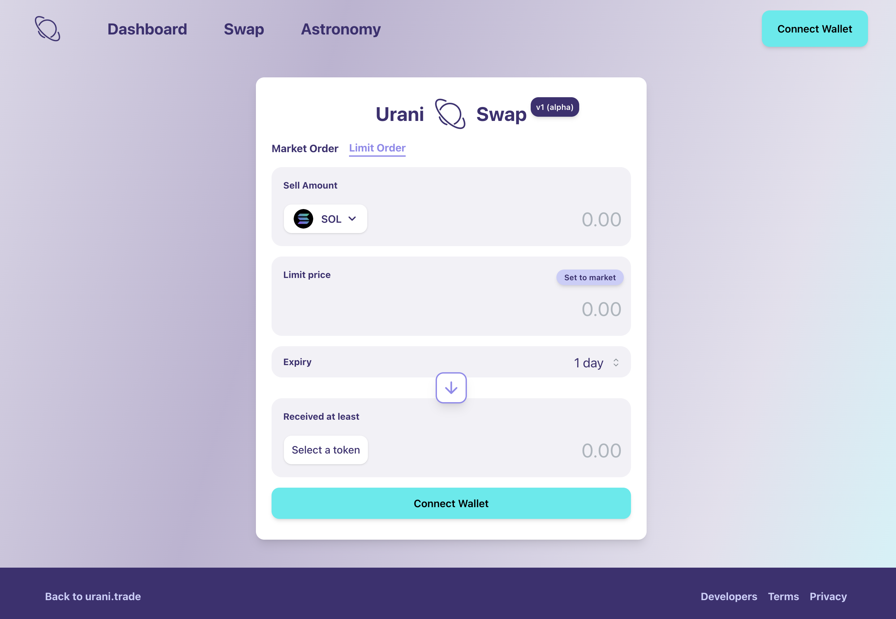

## Urani Swap for Solana

 

 

#### 👉🏼 The interface allowing users to submit order intents for consumption by the Urani Protocol on the Solana blockchain.

#### 👉🏼 Documentation on [local developer setup](docs/setup.md).

#### 👉🏼 Documentation on [features and technical decisions](docs/features.md).

 

---

### Resources

 

#### Tech Stack

- **[Next.js](https://nextjs.org/)**: a React framework that enables server-side rendering and generates static websites for enhanced performance.
- **[TypeScript](https://www.typescriptlang.org/)**: a strongly typed programming language that builds on JavaScript, providing type safety and better developer tooling.
- **[React](https://reactjs.org/)**: a component-based JavaScript library for building user interfaces that uses declarative and functional concepts.
- **[Tailwind CSS](https://tailwindcss.com/)**: a utility-first CSS framework for rapid UI development with a highly customizable design system.
- **[Vercel](https://vercel.com/)**: a platform for frontend frameworks and static sites, providing fast and reliable deployments.
- **[Mantine](https://mantine.dev/)**: a powerful React + Tailwind component library offering many prebuilt components for common use cases. Used in complex cases that require a powerful and flexible component.

 

#### External documentation

- **[Token List by Trust Wallet](https://github.com/trustwallet/assets/blob/master/blockchains/solana/tokenlist.json)**: a comprehensive list of tokens used for Solana applications.
- **[Wallet Adapter](https://github.com/anza-xyz/wallet-adapter)**: a modular TypeScript wallet adapters and components for Solana applications.
- **[Jupiter](https://jupiter.ag/)**: used for handling market orders within the Swap platform.
- **[Pyth](https://pyth.network/)**: for Price Feeds on Limit Orders.
- **[Hellius](https://hellius.io/)**: an RPC provider used for reliable and efficient communication with the Solana blockchain in Mainnet. Used for fetching token balances and submiting intents for Market Orders.

 

---

### License and Contributing

 

This project is distributed under the **[Apache 2.0 license](https://www.apache.org/licenses/LICENSE-2.0)**. 

You are welcome to contribute. See the guidelines **[here](docs/CONTRIBUTING.md)**.

 

